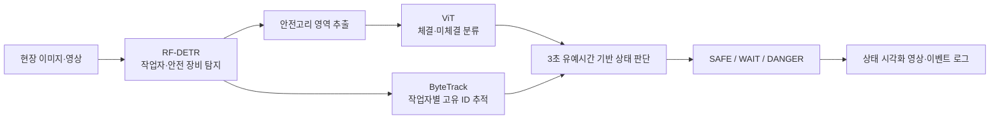

# 🦺 건설 현장 안전고리 체결 여부 판단 시스템

영상 속 작업자와 안전 장비를 탐지하고, 안전고리 체결 상태를 분석해  
현장 안전관리자의 위험 상황 확인을 돕는 컴퓨터 비전 프로젝트입니다.

[Code](https://github.com/Tacademy-DL-team1/code) · [Docs](https://github.com/Tacademy-DL-team1/docs)

## 프로젝트 개요

건설 현장의 추락 사고를 예방하려면 작업자의 안전대 착용 여부뿐 아니라 안전고리가 생명줄이나 구조물에 실제로 체결됐는지 확인해야 합니다. 하지만 안전고리는 영상에서 작게 보이고, 작업자·장비에 가려지거나 복잡한 배경과 겹치는 경우가 많습니다.

이 프로젝트는 객체 탐지·세그멘테이션, 이미지 분류, 객체 추적과 시간 기반 상태 판단을 결합해 영상 속 안전고리 상태를 분석합니다. 예측 결과는 사람의 안전 점검을 대체하는 판정이 아니라, 안전관리자가 확인할 위험 장면을 선별하는 보조 정보로 사용합니다.

## 분석 흐름

## 주요 기능

- 작업자, 안전대, 안전고리, 랜야드, 생명줄 후보 탐지
- YOLOv8, YOLOv11, RT-DETR, RF-DETR 객체 탐지·세그멘테이션 비교
- 최종 선정 RF-DETR 기반 작업자·안전 장비 탐지
- EfficientNet B0/B1/B2와 ViT의 안전고리 체결·미체결 분류 비교
- 최종 선정 ViT 기반 안전고리 상태 분류
- ByteTrack 기반 작업자별 고유 ID 추적
- 일시적 미탐을 위험으로 단정하지 않는 3초 유예시간 적용
- `SAFE`, `WAIT`, `DANGER` 상태 시각화와 이벤트 로그 생성
- 이미지·영상 추론 결과와 실패·한계 사례 분석

`WAIT`는 일시적인 미체결이나 촬영 각도에 따른 미탐을 바로 위험 상황으로 판단하지 않도록 두는 유예 상태입니다.

## 데이터셋

- 원본 학습 이미지: 1,077장
- 데이터 증강 후: 2,369장
- 최종 라벨: `worker`, `harness`, `hook`, `lanyard`, `lifeline`
- 다양한 크기와 각도에서 작은 안전고리를 탐지할 수 있도록 건설 현장 이미지와 영상 활용

## 모델 선정 결과

| 단계 | 비교 모델 | 최종 모델 | 주요 성능 |
| --- | --- | --- | --- |
| 객체 탐지·세그멘테이션 | YOLOv8, YOLOv11, RT-DETR, RF-DETR | **RF-DETR** | mAP50 `0.8405`, mAP50-95 `0.5779` |
| 체결 상태 분류 | EfficientNet B0/B1/B2, ViT | **ViT** | Recall `94.79%`, F1-score `92.86%`, Accuracy `92.71%` |

> 위 수치는 발표자료의 테스트 데이터와 평가 환경을 기준으로 하며, 다른 현장과 촬영 조건에서 동일한 성능을 보장하지 않습니다.

## 저장소 안내

| 저장소 | 내용 |
| --- | --- |
| [`code`](https://github.com/Tacademy-DL-team1/code) | 학습·추론 코드, 실험 노트북, 전처리 도구, 실행 환경 안내 |
| [`docs`](https://github.com/Tacademy-DL-team1/docs) | 회의록, 프로젝트 보고서, 발표자료, 참고문헌, Notion 문서 자동화 |

대용량 데이터셋, 학습된 모델 가중치와 추론 영상은 저장소 용량 및 배포 권한을 고려해 Git에서 제외합니다.

## 기술 스택

`Python` · `PyTorch` · `TorchVision` · `RF-DETR` · `RT-DETR` · `YOLO` · `ViT` · `EfficientNet` · `OpenCV` · `Supervision` · `ByteTrack` · `scikit-learn` · `Jupyter` · `Google Colab`

## 프로젝트 산출물

- 안전고리 체결 상태 분류 모델 실험
- 건설 현장 객체 탐지·세그멘테이션 모델 비교
- 객체 추적과 상태 머신을 결합한 영상 분석 파이프라인
- 최종 데모 영상, 실패 사례와 고도화 보고서

## 한계와 발전 방향

- 작은 객체와 복잡한 배경에서 유사한 물체를 안전고리로 오탐할 수 있음
- 체결·미체결 클래스 간 데이터 불균형으로 미체결 분류 성능이 낮아질 수 있음
- 보안 문제로 다양한 실제 공사장 CCTV 영상을 충분히 확보하지 못함
- 하네스와 랜야드의 연결 방향에 따라 체결 여부 확인이 어려운 장면이 존재함
- hook 미탐은 미체결 확정이 아니라 영상에서 안전 상태를 확인하지 못한 상황일 수 있음
- 실제 적용을 위해 추가 데이터 확보, 모델 경량화와 다양한 현장 환경 검증이 필요함

## 안전 고지

이 프로젝트의 예측은 현장 안전관리자의 판단과 법정 안전 점검을 대체하지 않습니다. 실제 운영 환경에 적용하기 전에는 현장별 데이터 검증, 안전 전문가 검토, 개인정보 및 영상 사용 권한 확인이 필요합니다.

---

📆 26.06.16 ~ 26.07.14 \
🙋‍♂️ SK플래닛 T아카데미 ASAC 11기 4인 Team Project
